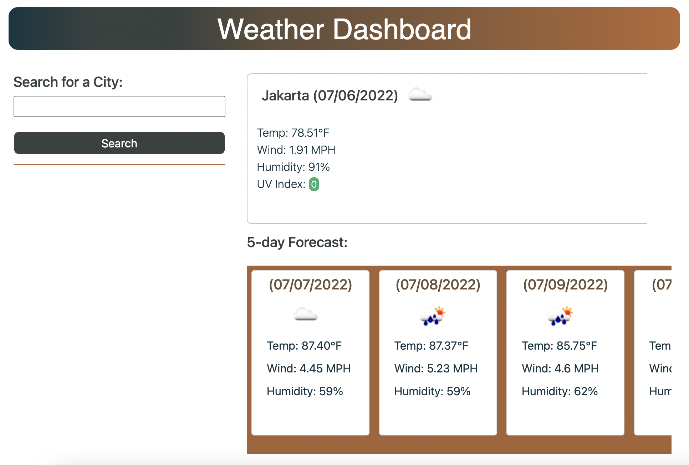

# Weather Dashboard

repo: https://github.com/sihayah/weather-dashboard
deployment: https://sihayah.github.io/weather-dashboard/

This is application allows the user to search for a city to retrieve the current weather as well as a five day forecast. The weather is displayed with corresponding icons, and the uvi is color-coded to match its intesity. The user's search history is saved in a series of buttons under the search input.